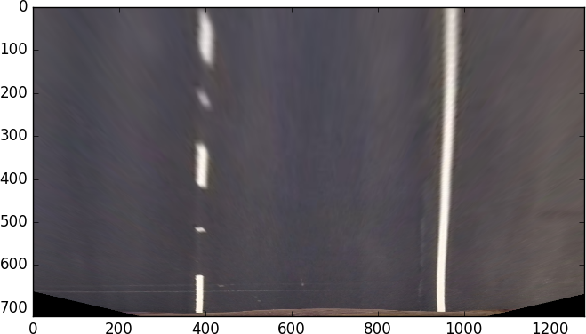

## Advanced Lane Finding Project

In this project, I have implemented a pipeline for and advanced lane detection in a video by using computer vision. The goals / steps of this project are the following:
* Compute the camera calibration matrix and distortion coefficients given a set of chessboard images.
* Apply a distortion correction to raw images.
* Use color transforms, gradients, etc., to create a thresholded binary image.
* Apply a perspective transform to rectify binary image ("birds-eye view").
* Detect lane pixels and fit to find the lane boundary.
* Determine the curvature of the lane and vehicle position with respect to center.
* Warp the detected lane boundaries back onto the original image.
* Output visual display of the lane boundaries and numerical estimation of lane curvature and vehicle position.


### Image distortion  

A camera converts 3D images from the real world into a 2D picture, it is not perfect. There is always a small distortion, which cam change the shape and size of the objects. In a self driving car, we need to measure curvature in order to know where to steer, so this becomes a problem. The first thing that we need to do is correct that distiontion, so that we can correctly measure what we need from the undistorted picture.   

Other things that can be affected by distortion:  
-Distorion can cause an object's appearance to change depending on where it is on the field view.
-Distortion can make object appear closer or farther away than they actually are.  

### Camera calibration

Real cameras use curved lenses to form an image, and light rays often bend a little too much or too little at the edges of these lenses. This creates an effect that distorts the edges of images, so that lines or objects appear more or less curved than they actually are. This is called radial distortion, and it’s the most common type of distortion.

** Distortion Coefficients and Correction**

There are three coefficients needed to correct for radial distortion: k1, k2, and k3. To correct the appearance of radially distorted points in an image, one can use a correction formula. Fortunately, we can leave this job to OpenCV and the cv2.calibrateCamera() function.
 
The points in an distorted and undistorted (corrected) image are represebted below. The point (x, y) is a single point in a distorted image and (x_corrected, y_corrected) is where that point will appear in the undistorted (corrected) image. As you can see, we need two pictures. The first one will be the regular picture with the distortion and the second one must be a similar picture where no distortion exists. The classic way to do this, is with pictures of a chessbord, since we all know how a chessbord without distortion looks like.


Now, let's see how we do it with a picture taken with a real camera. First thing is that we need to find the corners that will be mapped against the corners of undistorted picture. We can get some help from OpenCV and use **cv2.findChessboardCorners()** and then call **cv2.calibrateCamera()** method. This will return distortion coefficients and others variables we need for distortion. Finally we can call **cv2.undistort()** method to undistort the distorted chessboard.


To get more details about this implementation of this, please refer to cell 1 of the notebook, wher the function **calibrateCamera()** appears.

### Edge detection

A color picture like the one in previous steps is not useful if we want to isolate the lines. There are many transformations that we can apply in order to get the lines. In the case of this project I have combined different transformations using Sobel Operator  

**abs_sobel_thresh_hls()**  
This function performs absolute sobel thresolding using HLS color space. It performs threshold X gradient on L channel and threshold color channel on S channel. The result of both is combined ant the one-channel picture is returned.
Refer to cell 3 in the notebook for details.

**threshold_hls()**  
This function performs color thresolding using HLS color space. 
Specifically, the thresholding is applied on H channel
 Refer to cell 2 in the notebook for details.

**abs_sobel_thresh()**  
Function that performs X or Y Sobel treshold on a color RGB picture
Refer to cell 4 in the notebook for details.

The functions are called this way and the result of each call is combined in a single picture. Each function is given a color picture and the threshold limits:  

 ```
 #Result of filter threshold_hls (binary threshold on H channel)
 result_flt  = threshold_hls(img, thresh=(110, 255))
 #Result of filter abs_sobel_thresh_hls (binary sobel threshold on L,S channel)
 result_flt2 = abs_sobel_thresh_hls(img,s_thresh=(170, 255), sx_thresh=(30,200))
 #Result of filter abs_sobel_thresh(binary sobel threshold on RGB channel, Y direction)
 result_flt3 = abs_sobel_thresh(img, orient='y', thresh_min=100, thresh_max=150)
 #Result of filter abs_sobel_thresh(binary sobel threshold on RGB channel, X direction)
 result_flt4 = abs_sobel_thresh(img, orient='x', thresh_min=20, thresh_max=255)
 ```  
 
And this is how the image looks like after applying the filters:  


Well, now we have an image where the lines are clear identified, but we also have all the edges of objects in the background that we do not need. We can remove that unneeded objects by defining a region of interest and setting in black all pixels outside of it. I have achieved this by creating the function **region_of_interest(img, vertices)** in the cell 9 in the notebook. This function receives an image (in this case a binary), and 4 points vertices variable. In my case the vertices were defined this way:

`vertices = np.array([[(150,imshape[0]),(540, 440), (770, 440), (imshape[1]-90,imshape[0])]], dtype=np.int32)`

And then a polygon is filled setting in black undesired region:
```
 #filling pixels inside the polygon defined by "vertices" with the fill color    
    cv2.fillPoly(mask, vertices, ignore_mask_color)
    
    #returning the image only where mask pixels are nonzero
    masked_image = cv2.bitwise_and(img, mask)
 ```
 
 
 
To get a better idea of what is covered by the mask, let's visualize the region in a color picture:  


 
And the result with edges detection looks like:  


All those calls are also found in cell 10 in the notebook where the function **undistort_warp()** appears. 

### Perspective Transformation

What is a perspective in an image?
Is when objects appear smaller the farther away they are from a viewpoint. 

Mathematically, we can characterize perspective by saying that in real world coordinates x,y and z. The greather the magnitude of an object z coornidate or distance from the camera, the smaller it will appear in a 2D image. A perspective transformation uses this information to transform an image, it essentially transforms the apparent z coordinate of the object points, which in turn changes the object 2D representation. 


Why do we need a perspective transformation in a self-driving car?

There are various reasons you might want to perform a perspective transform on an image, but in the case of road images taken from our front-facing camera on a car, the reason is that we want to measure the curvature of the lines, and to do that, we need to transform to a top-down view.  

Ok, now that we understand what is perspective transformation, we need to define 4 source point and 4 destination point. The points that I choose are:

```
src = np.float32([[480, 510], [800, 510], [80,720], [1200,720]])  
dst = np.float32([[330, 510], [985, 510], [300,720], [1000, 720]])
```  

Then we need to get the perspective transformation with **cv2.getPerspectiveTransform(src, dst)**, and also the inverse transform inverting the src and dst point. Now we can warp the picture using the perspective transformation that we got.
To do this, we use **cv2.warpPerspective()** function.

And this is how it looks:  



Now with curved lines and edges detection (which is how they are really procesed):  


You can find all details about this step in cell 10 in the notebook where the function **undistort_warp()** appears. It finally returns the undistorted and warped binary image where a region of interest has been selected.


### Extracting information 

#### Blind search
Now that we have an undistorted and warped picture, we can proceed to extract the information that we need from the picture. The first thing that we want to do is to search for the lines in the image, but they will not have the same shape and curvature in each image, so we need to make a "blind" search. To do this, we create a histogram along all the columns in the lower half of hte image like this:

``` 
histogram = np.sum(img[img.shape[0]/2:,:], axis=0)  
plt.plot(histogram)
```  
  


Ok, now that we have a histogram, we can proceed with sliding windows, which consists on identifying the peaks in the base that were identified in the histogram, and then with a small window and go up in the picture finding the hot pixels where the lines are. I have choosen to use 9 windows with a margin of 110 pixels and a min of 90 pixels to recenter the window. 

Once our blind search has found the lines, we can fit a second order polynomial:

```
#Fit a second order polynomial to each  
left_fit = np.polyfit(lefty, leftx, 2)  
right_fit = np.polyfit(righty, rightx, 2)
```  

And if we want to visualize the lines:  
```
#Generate x and y values for plotting
ploty = np.linspace(0, binary_warped.shape[0]-1, binary_warped.shape[0] )
left_fitx = left_fit[0]*ploty**2 + left_fit[1]*ploty + left_fit[2]
right_fitx = right_fit[0]*ploty**2 + right_fit[1]*ploty + right_fit[2] 
```

And the result looks like this:


You can find all the details of this blind search in cell 5 of the notebook where function **blindSearch(binary_warped, visualize = False)** appears. It receives a binary warped picture as a parameter and returns the polynomials for left and right lines.

Note: Blind search will not be used in every frame, I have also created a function called **lineFinding(binary_warped, left_fit, right_fit, visualize=False)** which besides the binary warped image, it receives the polynomial fits of previous detection, so that they can be used to perform the new search. You can find it in cell 6 of the notebook.


#### Measuring curvature and center distance

Radius of Curvature

The radius of curvature (awesome tutorial here) at any point x of the function x=f(y) is given as follows:


In the case of the second order polynomial above, the first and second derivatives are:


So, our equation for radius of curvature becomes:


The y values of the image increase from top to bottom, so if we want to measure the radius of curvature closest to the vehicle, we could evaluate the formula above at the y value corresponding to the bottom of the image image.

In code, that formula looks like this:
```
# Define y-value where we want radius of curvature
# I'll choose the maximum y-value, corresponding to the bottom of the image
y_eval = np.max(ploty)
left_curverad = ((1 + (2*left_fit[0]*y_eval + left_fit[1])**2)**1.5) / np.absolute(2*left_fit[0])
right_curverad = ((1 + (2*right_fit[0]*y_eval + right_fit[1])**2)**1.5) / np.absolute(2*right_fit[0])
print(left_curverad, right_curverad)
# Example values: 1926.74 1908.48
```
Now we need to convert those pixel values in real world measurements. We will assume that the lane in our picture is about 30 meters long and 3.7 meter wide, according to U.S regulations. Check out ["U.S. government specifications for highway curvature"]( http://onlinemanuals.txdot.gov/txdotmanuals/rdw/horizontal_alignment.htm#BGBHGEGC) for more details

```
 # Define conversions in x and y from pixels space to meters
    ym_per_pix = 30/600 # meters per pixel in y dimension
    xm_per_pix = 3.7/540 # meters per pixel in x dimension

    # Fit new polynomials to x,y in world space
    left_fit_cr = np.polyfit(ploty*ym_per_pix, leftx*xm_per_pix, 2)
    right_fit_cr = np.polyfit(ploty*ym_per_pix, rightx*xm_per_pix, 2)
    # Calculate the new radius of curvature
    left_curverad = ((1 + (2*left_fit_cr[0]*y_eval*ym_per_pix + left_fit_cr[1])**2)**1.5) / np.absolute(2*left_fit_cr[0])
    right_curverad = ((1 + (2*right_fit_cr[0]*y_eval*ym_per_pix + right_fit_cr[1])**2)**1.5) / np.absolute(2*right_fit_cr[0])
 ```
I have implemeted the function **calculateCurvature(left_fit, right_fit, ploty, plot=False)** in cell 6 in the notebook, which receives the polynomials that were found by *blindSearch()* or *lineFinding()* function and returns the lines curvature in meters for left and right lines. 


#### Keeping track of lanes detection

Ok, we have detected and calculated all we need from the image, but when working with a video instead of a single picture, it is useful to save the information of previous frame in order to make our pipeline more robust. In order to do this, I have created a class called Line which is used to save the information of the lines detected in the frames. The class look like this:

```
# Class created to keep track of detected lines
class Line():
    
    def __init__(self, left_fit, right_fit, left_fitx, right_fitx, ploty, Minv, imgShape ):
        #Inverse perspective
        self.Minv = Minv
        # was the line detected in the last iteration?
        self.detected = False
        # lines detected in search
        self.left_fit = left_fit
        self.right_fit = right_fit
        # lines fitted created based on search detection
        self.left_fitx = left_fitx
        self.right_fitx = right_fitx
        # Y values for lines
        self.ploty = ploty
        # radius of curvature per line
        self.left_curverad = None
        self.right_curverad = None
        # Image shape
        self.imgShape = imgShape
        
    # Calculate distance to the center of the road
    def getLineBasePos(self):
       ... 
    # Checks if the lines are separated by at least 3.7 m.
    def isGoodSeparation(self):
       ...
    # Average the over the last 10 well detected iterations so that lines are smoother
    def setLineAverage(self, colaL, colaR, reset):
        ...
```

In the class, you can see the information that we save; such as lines polynomials, inverse perspective matrix, etc. The class also has 3 helper functions tha are described next.

**getLineBasePos()**  
This function is used to calculate the distance to the center of the road, we are assuming that the camera is perfectly centered in the car, so we use the top extremes of the polynomials for the lines and divide by two. 
```   
camera_center = (self.left_fitx[-1] + self.right_fitx[-1])/2 #Assumes camera is perfectly centered
```
Then we substract from found camera center, half of the wide measurement of the image and multiply by the variable that stores the conversion from pixels to meters.
```
center_diff = (camera_center - self.imgShape[1]/2)*xm_per_pix
```

**isGoodSeparation()**  
This function checks if the lines separation is according to the minimum of 3.7 meters indicated by U.S. regulations. We use the extremes of the polynomials for the lines and substract one from each other, then conversion to meters is performed and finally returns True if lines are in compliance.
```   
lines_distance = ( np.max(self.right_fitx) - np.min(self.left_fitx))*xm_per_pix
if lines_distance < 3.7:
    return False
else:
    return True
```
**setLineAverage()**  
This function averages the last 10 well detected polynomials. It receives a queue for each line, appends the last polynomial found and then get the mean.
``` 
colaL.append(self.left_fit)
colaR.append(self.right_fit)
# Averages only is there is more than one line already detected
    if len(colaL)>1:
        self.left_fit, self.right_fit = np.mean(colaL, axis=0), np.mean(colaR, axis=0)
``` 
I have implemeted this class and its functions in cell 11 in the notebook.

There is also an extra function outside Lane class that is used to check if lines detected are ok in comparion to previous ones. This is implemented in cell 12 with the function **goodLines(prevLine, newDetected)** which receives the previous and new detected lines. It calculates the sum of squares of the difference between x fits and if it found a big difference it considers tha the new lines are not "good":

```
# Calculates the sum of squares of the difference of x fits
    s = np.sum((prevLine.left_fitx-newDetected.left_fitx)**2)
    s2 = np.sum((prevLine.left_fitx-newDetected.left_fitx)**2)
```
In my case a good threshold value was 300000:
```
# maxium difference allowed
sqrtSumMax = 300000
```
### Plotting lane

Once we have all the information we need in order to plot the lane, we need to make use of fitted lines that were found in previous steps and the inverse transformation in order to return to original perspective. I have created in cell 8 of the notebook, the function **plotLines(warped, original, linesDetected)** which receives a the warped binary image, the original image, and the instance of Lane class where the information about the lines is stored. 

First, it recast the x and y points into usable format for cv2.fillPoly(). And then create an image to draw lines on
```
    pts_left = np.array([np.transpose(np.vstack([left_fitx, ploty]))])
    pts_right = np.array([np.flipud(np.transpose(np.vstack([right_fitx, ploty])))])
    pts = np.hstack((pts_left, pts_right))    
    
    # Create an image to draw the lines on
    warp_zero = np.zeros_like(warped).astype(np.uint8)
    nonzero = warped.nonzero()
    nonzeroy = np.array(nonzero[0])
    nonzerox = np.array(nonzero[1])   
```
Then draws the lane onto the warped blank image:

 `cv2.fillPoly(color_warp, np.int_([pts]), (0,255, 0))`
    
 Finally it warps the blank back to original image space using inverse perspective matrix (Minv) and combines the result with the original image.
 ```
  # Warp the blank back to original image space using inverse perspective matrix (Minv)
    newwarp = cv2.warpPerspective(color_warp, Minv, (original.shape[1], original.shape[0])) 
    # Combine the result with the original image
    result = cv2.addWeighted(original, 1, newwarp, 0.3, 0)
 ```
 A similar process is done to draw the belonging lines of the lane.  
 Here you can visualize a previous and after of the whole process:
 
 
 
 
### Processing videos with the pipeline


Now that we know all necessary steps, we need to encapsulate them in a method that will take place as our pipeline. This is implemented in cell 12 of notebook with a function called **processImagePipeline(img)**. This function takes an unprocessed image from the video and follows this flow for each image of the video:

1. take the original image and call **undistort_warp()** to get a undistorted an warped binary image.  
2. Check if it is first run or resetSearch flag is true; if yes, then use **blindSearch()**, otherwise use **lineFinding()** taking advange of previous detected lines. At this point we have the polynomial for both lines. If it is firt run or a reset it also create the Lines instance as prevLines and save the values found.
4. Check if lines were detected. If not, adds one to wrongConsecutive variable and reuse the lane values from previous well detected.
5. Check if previous lane detection was good, if not, remove the values from the queues in order not to mess up the averages. If queues are empty, it means that a reset in the search needs to be done (blind search again) and the flag resetSearch is set to true.
6. Calculate radius curvature by calling **calculateCurvature()** function. 
7. Create an instance with new lines detected and add curvature radius.  
8. Check if the lines have a good separation by calling **newLines.isGoodSeparation()**, if not, then set resetSearch flag to true.
9. Average lines detectd by calling **newLines.setLineAverage(colaL, colaR)** and passing queues for both lines.  
10. Make previous lane the same as new lines so that this can be used as previous lines in next iteration.
11. Plots the lane in the original pictyre by calling **plotLines(undistorted, img, newLines)**.
12. Draw the calculated radius of curvature, distance to the center information in the image. Aditionally plots an error message in case current frame was a problematic one.
13 Returns the picture with lane and its lines plotted, as well as lane information.

The pipeline is called in cell 13 of the notebook, where **calibrateCamera()** is executed, some global variables are declared and the video is also loaded. Once the pipeline is executed for each frame the video is saved:

 ```
 ....
# Output video with lane plotted
white_output = '../videos/project_video_result.mp4'
# Input video
clip1 = VideoFileClip("../videos/project_video.mp4")
# Calibrate camera before start processing the frames.
# we get the camera matrix, distortion coefficients, rotation and translation vectors etc.
ret, mtx, dist, rvecs, tvecs = calibrateCamera()
# Process the video frame by frame calling processImagePipeline
white_clip = clip1.fl_image(processImagePipeline)
 ```
 
You can watch the video of the result in the next link or in videos folder in this project folder:  
 ["Project video"]( https://youtu.be/k2HSQUjN6iQ)

### Discussion  

The pipeline works quite well for the project video, resulting in no more than 5 bad detections that does not represent an issue due to the averages of previous lines. There are no cases in which the lane is totally lost. The major issues that I foud were when the light condition changes abruptly due to shadows, or also when the road in in bad conditions and there are different tonalities in the asphalt that are detected as a lane line ( as in challenge video). In order to make the pipeline more robust it is necessary to try with other threshold values for Sobel filter or also explore another techniques with different color spaces or other transformation that do not requiere edge detection. 